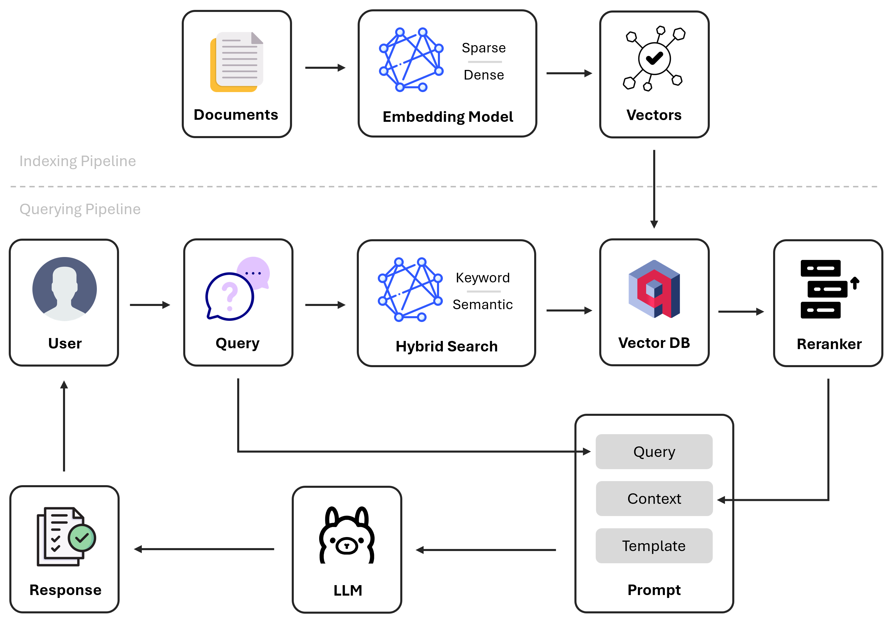

# Advanced RAG for Medication NER

This project demonstrates a novel application of Retrieval-Augmented Generation (RAG) for Named Entity Recognition (NER) in healthcare. The solution combines advanced search techniques and large language models (LLMs) to accurately extract medication-related entities, including drug names, dosages, quantities, administration types, and brands, from unstructured text. By leveraging hybrid search and reranking, the system achieves state-of-the-art accuracy in processing complex medical datasets.

## Table of Content

1. **[Features](#features)**
2. **[Architecture Overview](#architecture-overview)**
3. **[Tech Stack](#tech-stack)**
4. **[Installation](#installation)**
5. **[Usage](#usage)**
6. **[Dataset](#dataset)**

## Features

- **Accurate Medication NER**: Extracts medication-related entities such as drug names, quantites, dosages, administration types, and brands from unstructured text.
- **Hybrid Search and Reranking**: Combines dense and sparse retrieval methods to boost accuracy by fetching contextually similar few-shot examples.
- **Small Language Model**: Utilizes small GenAI LLM such as Llama3.2 3B Parameters for efficient processing and low latency.
- **Customizable Framework**: Supports customization to adapt to different use cases and requirements.

## Architecture Overview



- Two-Stage Retrieval
  - Hybrid Search
    - Dense (Semantic Search)
    - Sparse (Keyword Search)
  - Reranking Module
    - Transformers-based
- Local LLM (i.e. Llama 3.2 3B)
- Indexing and Querying Haystack Pipelines
- Custom Prompt Template

## Tech Stack

- Ollama
- Qdrant
- Haystack
- Transformers
- Python
- FastAPI
- Asyncio
- Docker

## Performance

### Entity Extraction

Tested on an evaluation dataset consisting of 335 medication texts. 

- Accuracy: 92.2 %
- Precision: 100 %
- Recall: 92.2 %
- F1-Score: 95.9 %

### Latency
- Average processing time per medication text: 1.33 seconds

The RAG application is more suited for batch processing tasks that runs in the background, not for real-time tasks as seen from the latency results.

## Installation

There are 2 main approaches to setup this project for local development when customizing the framework to adapt to other use cases:
- Rapid Prototyping
- Standard Development

**Rapid Prototyping** involves running only the Qdrant docker container (i.e. `docker-compose.local.yml`) and rely on locally installed Ollama for text-generation and inferences. One that uses Poetry virtual environment to run the RAG application. Reliant on the environment variables from `.env.local` as the Qdrant and Ollama HOST is different from the standard development process.

**Standard Development** involves running the complete Docker setup (i.e. `docker-compose.yml`) that includes building the RAG app docker image, spinning up both Qdrant and Ollama docker containers. During development, the RAG app docker image will have to be built with every changes to the codebase, which may incur additional disk space to be used during the build process even when the image layers are being cached.

**Quick Test** involves running the bare minimum Docker setup for testing purposes, pulling the docker image from Docker Hub, which is only reliant on Docker Compose and the ENV file to spin up the containers to access the API endpoints and test the application locally.

For better developer experience, it is recommended to go with **Rapid Prototyping** as it is less time-consuming and resource-intensive, though it does take a considerable effort for the initial setup.

### System Setup

1. Check if `en_US.UTF-8` is set as the default locale.
2. Otherwise, set locale with `sudo locale-gen en_US.UTF-8` if you are running on Linux/WSL ecosystem.
3. This is to circumvent the error of running the pre-commit hooks when committing code to GitHub.
4. Clone the repository with `git clone https://github.com/JackLeeJM/rag-medication-ner.git`.

### Rapid Prototyping Setup

1. Install [Just](https://github.com/casey/just?tab=readme-ov-file#installation).
2. Install [Poetry](https://python-poetry.org/docs/#installation).
3. Install [Ollama](https://ollama.com/download).
4. Install [Docker Desktop](https://www.docker.com/).
5. Setup **Poetry** and install dependencies with `just install`.
6. Create a local ENV file with `just env-local`.
7. Spin up docker containers with `just up-local`.
8. Activate the virtual environment with `poetry shell`.
9. Start FastAPI server with `just run`.
10. Go to `http://localhost:8000/docs` to access the API docs to test the endpoints.
11. Use keyboard shortcut `Ctrl + C` to exit the FastAPI server.
12. Any changes to the codebase will be reflected immediately, run `just run` again to boot up the FastAPI server again.

### Standard Development Setup

> [!NOTE]
> EXTERNAL_PORT values for FastAPI, Qdrant, and Ollama are customizable in the `.env` file.

1. Install [Just](https://github.com/casey/just?tab=readme-ov-file#installation).
2. Install [Docker Desktop](https://www.docker.com/).
3. Create a local ENV file with `just env`.
4. Spin up docker containers with `just up`, or `just up-cpu` in favor of using CPU instead of GPU.
5. Go to `http://localhost:8040/docs` to access the API docs and test the endpoints.
6. Run `just down` to stop and remove all docker containers.
7. Start customizing the prompt template and data to suit your specific use case.
8. Once the custom changes are complete, version bump the app service's image (1.0.0 > 1.0.1) and run `just up` to update the docker image.

### Quick Test

1. Install [Docker Desktop](https://www.docker.com/).
2. Create a new file `.env`, and copy content of `.env.sample` into it.
3. Pull the docker image from Docker Hub with `docker pull jackleejm/rag-medication-ner:v1.0.0`.
4. Spin up docker containers with `docker-compose up -d`.
5. Go to `http://localhost:8040/docs` to access the API docs and test the endpoints.
6. Run `docker-compose down` to stop and remove all docker containers.


## Usage

### API Endpoint for Entity Extraction

- **Method**: POST
- **Path**: `/extract`
- **Description**: Extracts entities from a given list of unstructured text
- **Request Body**:
  ```json
  {
    "text": [
        "Acetaminophen 325 MG Oral Tablet",
        "Ibuprofen 100 MG Oral Tablet"
    ]
  }
  ```
- **Response Example**:
  ```json
  {
    "results": [
        {
            "original_text": "Acetaminophen 325 MG Oral Tablet",
            "quantity": [],
            "drug_name": [
                "Acetaminophen"
            ],
            "dosage": [
                "325 MG"
            ],
            "administration_type": [
                "Oral Tablet"
            ],
            "brand": []
        },
        {
            "original_text": "Ibuprofen 100 MG Oral Tablet",
            "quantity": [],
            "drug_name": [
                "Ibuprofen"
            ],
            "dosage": [
                "100 MG"
            ],
            "administration_type": [
                "Oral Tablet"
            ],
            "brand": []
        }
    ],
    "processing_time": 1.5
  }
  ```

### API Endpoint for Indexing Medications

- **Method**: POST
- **Path**: `/index`
- **Description**: Index medications into vector database, to add more few-shot examples for better in-context learning performance.
- **Request Body**:
  ```json
  {
    "medications": [
        {
            "original_text": "1 ML medroxyprogesterone acetate 150 MG/ML Injection",
            "quantity": [
                "1 ML"
            ],
            "drug_name": [
                "medroxyprogesterone acetate"
            ],
            "dosage": [
                "150 MG/ML"
            ],
            "administration_type": [
                "Injection"
            ],
            "brand": []
        },
        {
            "original_text": "budesonide 0.125 MG/ML Inhalation Suspension [Pulmicort]",
            "quantity": [],
            "drug_name": [
                "budesonide"
            ],
            "dosage": [
                "0.125 MG/ML"
            ],
            "administration_type": [
                "Inhalation Suspension"
            ],
            "brand": [
                "Pulmicort"
            ]
        }
    ]
  }
  ```
- **Response Example**:
  ```json
  {
    "message": "Successfully indexed 2 entities",
    "processing_time": 0.05,
  }
  ```

## Dataset

The training dataset is generated using an open-source project called [Healthcare Data Generator](https://github.com/JackLeeJM/healthcare-data-generator) that is based on [Synthea](https://github.com/synthetichealth/synthea), which is a synthetic healthcare data generator that creates realistic patient records. The raw dataset is then manually annotated and validated for accuracy and completeness by checking the original_text to the extracted entities.
